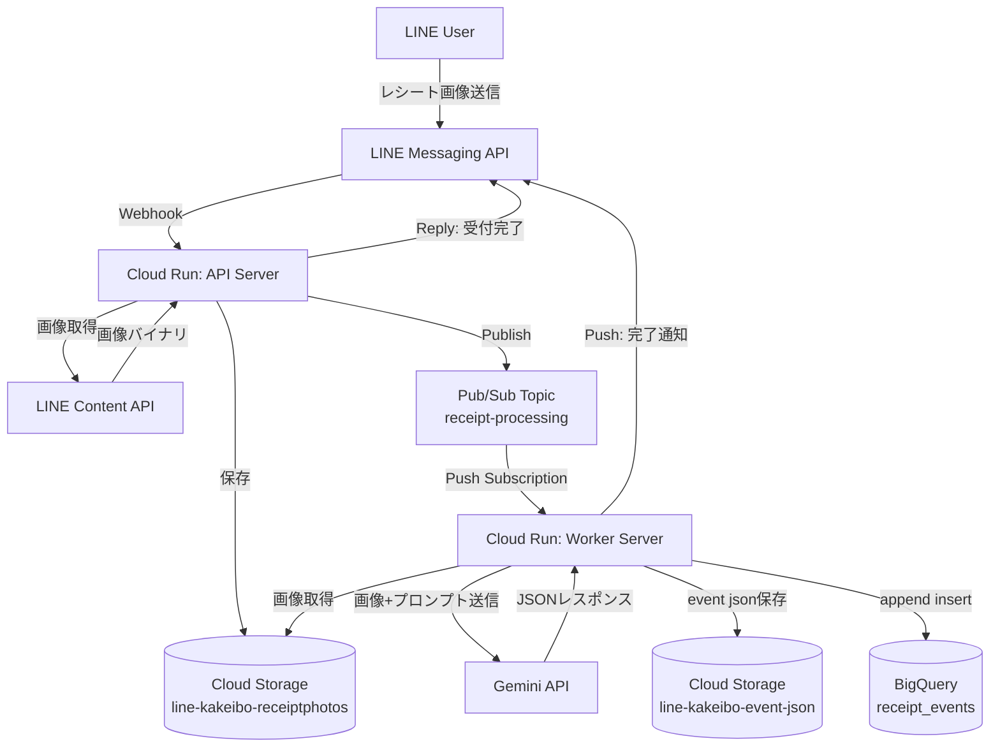

```mermaid
flowchart TD
    U[LINE User] -->|レシート画像送信| L[LINE Messaging API]

    L -->|Webhook| API[Cloud Run: API Server]

    API -->|画像取得| LINECONTENT[LINE Content API]
    LINECONTENT -->|画像バイナリ| API

    API -->|保存| GCSIMG[(Cloud Storage\nline-kakeibo-receiptphotos)]
    API -->|Publish| PS[Pub/Sub Topic\nreceipt-processing]
    API -->|Reply: 受付完了| L

    PS -->|Push Subscription| WORKER[Cloud Run: Worker Server]

    WORKER -->|画像取得| GCSIMG
    WORKER -->|画像+プロンプト送信| GEMINI[Gemini API]
    GEMINI -->|JSONレスポンス| WORKER

    WORKER -->|event json保存| GCSJSON[(Cloud Storage\nline-kakeibo-event-json)]
    WORKER -->|append insert| BQ[(BigQuery\nreceipt_events)]
    WORKER -->|Push: 完了通知| L
```